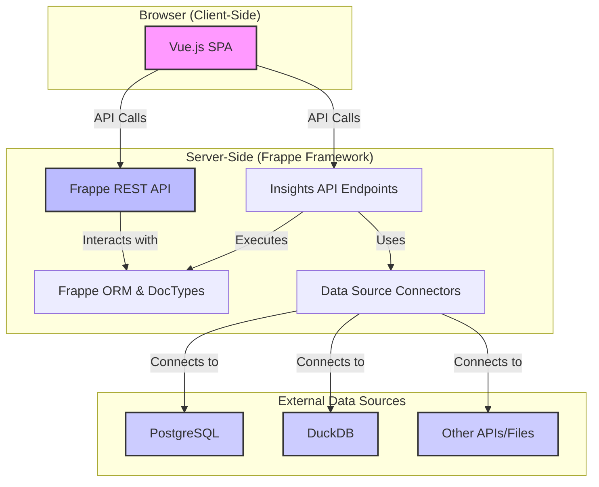

# 1. Architecture Overview

The Insights application is engineered as a modern, decoupled web application, leveraging the power of the Frappe Framework for its backend and a sophisticated Vue.js single-page application (SPA) for its frontend. This architecture is designed for scalability, maintainability, and a rich, interactive user experience.

## Architectural Philosophy

The core design philosophy is to separate concerns cleanly:

1.  **Backend (Frappe Framework):** Serves as the primary data and business logic layer. It is responsible for:
    *   Data modeling through Frappe **DocTypes**.
    *   Secure and robust API endpoints (`@frappe.whitelist`).
    *   Connecting to and managing external **Data Sources**.
    *   Executing complex **Queries** and data transformations.
    *   Handling user authentication, permissions, and background jobs.

2.  **Frontend (Vue.js):** Provides a dynamic and responsive user interface for data exploration and visualization. It is responsible for:
    *   Rendering interactive charts, tables, and dashboards.
    *   Building and composing queries through a user-friendly interface.
    *   Managing application state and client-side routing.
    *   Communicating with the Frappe backend via asynchronous API calls.

This decoupled approach allows for independent development and scaling of the frontend and backend components.

## Core Technology Stack

*   **Backend:** Frappe Framework (v14+), Python
*   **Frontend:** Vue.js (v3), Vite, Pinia (for state management), Frappe UI
*   **Data Layer:** MariaDB (default Frappe DB), with connectors for external sources like PostgreSQL, DuckDB, etc.

## Component Diagram

The following diagram illustrates the high-level relationship between the key components of the Insights application.

## Data Flow Overview

1.  A **User** interacts with the **Vue.js SPA** to create or view a chart.
2.  The SPA sends an API request to an **Insights API Endpoint** on the Frappe server.
3.  The endpoint retrieves the definition of the required **Query** (a DocType).
4.  The **Data Source Connector** associated with the query establishes a connection to the relevant external or internal data source.
5.  The query is executed against the data source.
6.  The results are processed and returned to the **Vue.js SPA**.
7.  The frontend renders the data into the appropriate visualization (chart, table, etc.).